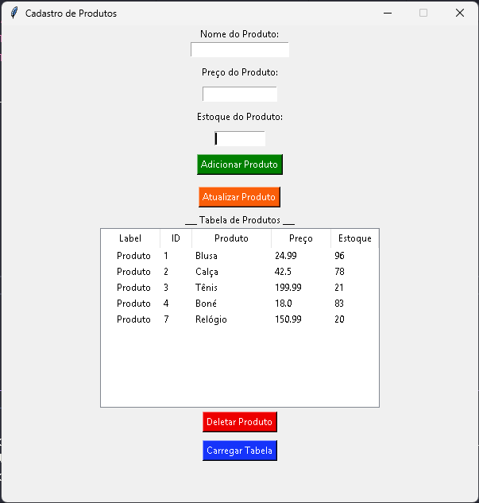
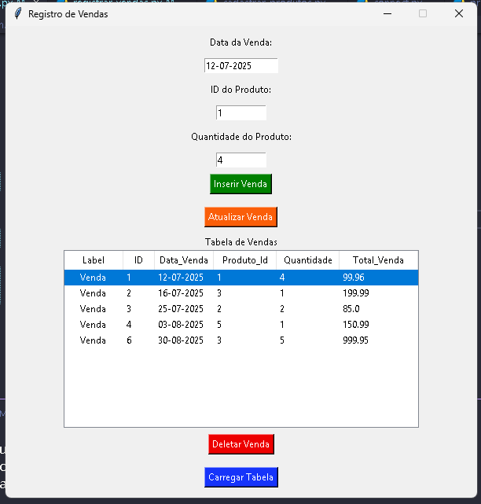
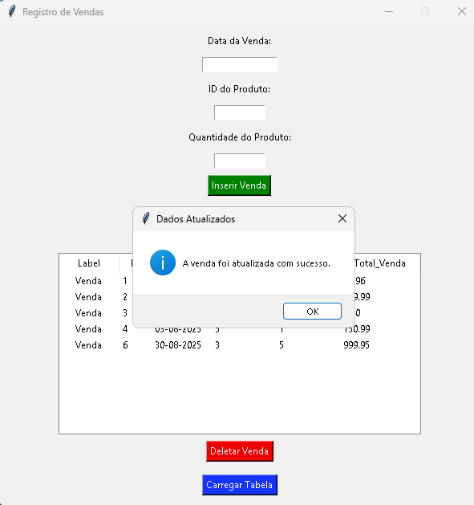
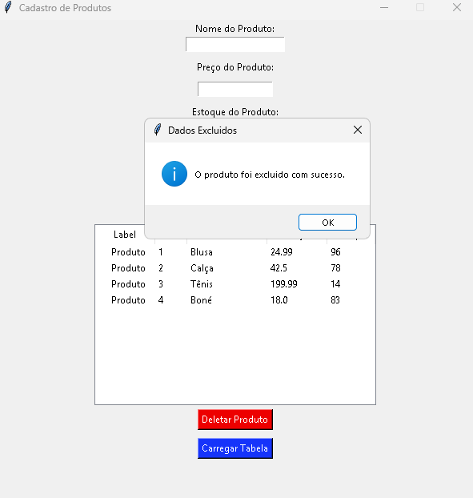

# 🛒 Projeto de Controle de Vendas  

Este projeto foi desenvolvido como parte do curso básico de Python.  
Ele permite realizar operações de **CRUD** (Criar, Ler, Atualizar e Deletar) tanto para **produtos** quanto para **vendas**, com integração a banco de dados **SQLite** e uma interface gráfica desenvolvida em **Tkinter**.  

## ✨ Funcionalidades  
- Cadastro, atualização, listagem e exclusão de produtos;  
- Registro, atualização, listagem e exclusão de vendas;  
- Cálculo automático do **valor total da venda**;  
- Atualização automática do **estoque dos produtos** conforme as vendas realizadas;  
- Interface gráfica intuitiva construída com **Tkinter**.  

## 🛠️ Tecnologias Utilizadas  
O projeto foi desenvolvido em **Python 3**, utilizando o **Tkinter** para construção da interface gráfica, o **SQLite** para o gerenciamento do banco de dados, e aplicando conceitos de **Programação Orientada a Objetos (POO)** para organizar e estruturar o código de forma mais clara e escalável.  

## 📚 Aprendizados  
Durante o desenvolvimento deste projeto, pratiquei e aprimorei:  
- Criação de interfaces gráficas com Tkinter;  
- Estruturação do código utilizando POO;  
- Conexão e manipulação de dados em SQLite;  
- Tratamento de erros com `try` e `except`.  

## 🚀 Como Executar o Projeto  
1. Clone este repositório:  
   ```bash
   git clone https://github.com/marcosviniciusribeiiro/controle_de_vendas.git

2. Acesse a pasta do projeto:
   ```bash
   cd controle_de_vendas

3. Execute o programa principal:
   ```bash
   python main.py

## 📷 Demonstração

### 🟢 Cadastro de Produtos  
  

### 🟠 Registro de Vendas  
  

### 🔄 Atualização de Produtos  
  

### ❌ Exclusão de Produtos  
  

# Conclusão

Este projeto representou um grande passo na consolidação dos meus conhecimentos em Python, banco de dados e lógica de programação, aplicados em um sistema real.
